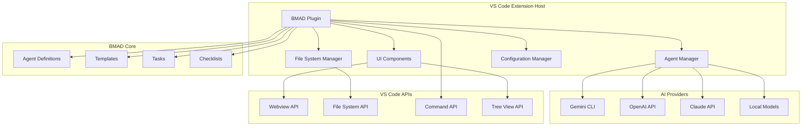

# Design Document

## Overview

Le plugin VS Code BMAD Method est une extension qui intègre nativement les capacités de BMAD Method dans l'environnement de développement VS Code. Il offre une interface utilisateur intuitive pour interagir avec les agents AI, créer des documents de projet, et maintenir un workflow de développement agile optimisé.

## Architecture

### High-Level Architecture



### Component Architecture

#### 1. Extension Entry Point
- **Activation**: Détection automatique des projets BMAD
- **Registration**: Enregistrement des commandes et vues
- **Initialization**: Configuration des providers AI

#### 2. Agent Manager
- **Agent Loading**: Chargement dynamique des agents BMAD
- **Session Management**: Gestion des sessions de chat avec les agents
- **Context Injection**: Injection du contexte projet dans les agents
- **Response Processing**: Traitement des réponses des agents

#### 3. UI Components
- **Sidebar Panel**: Vue principale avec liste des agents
- **Chat Interface**: Interface de conversation avec les agents
- **Document Preview**: Aperçu des documents générés
- **Configuration Panel**: Interface de configuration

#### 4. File System Manager
- **Project Detection**: Détection automatique des projets BMAD
- **Document Creation**: Création automatique de documents
- **Template Processing**: Traitement des templates BMAD
- **File Watching**: Surveillance des changements de fichiers

## Components and Interfaces

### Core Components

#### AgentManager
```typescript
interface AgentManager {
  loadAgent(agentId: string): Promise<Agent>
  createSession(agentId: string, context: ProjectContext): ChatSession
  sendMessage(sessionId: string, message: string): Promise<AgentResponse>
  getAvailableAgents(): Agent[]
}
```

#### ChatSession
```typescript
interface ChatSession {
  id: string
  agentId: string
  context: ProjectContext
  messages: ChatMessage[]
  sendMessage(message: string): Promise<AgentResponse>
  getHistory(): ChatMessage[]
  dispose(): void
}
```

#### ProjectContext
```typescript
interface ProjectContext {
  workspaceRoot: string
  bmadConfig: BmadConfig
  existingDocuments: DocumentMap
  currentFile?: string
  gitBranch?: string
}
```

### AI Provider Interfaces

#### AIProvider
```typescript
interface AIProvider {
  name: string
  isAvailable(): Promise<boolean>
  sendMessage(prompt: string, context: any): Promise<string>
  configure(config: ProviderConfig): void
}
```

#### GeminiProvider
```typescript
class GeminiProvider implements AIProvider {
  name = 'gemini'
  
  async isAvailable(): Promise<boolean>
  async sendMessage(prompt: string, context: any): Promise<string>
  configure(config: GeminiConfig): void
}
```

### UI Components

#### BmadSidebarProvider
```typescript
class BmadSidebarProvider implements vscode.TreeDataProvider<BmadTreeItem> {
  getTreeItem(element: BmadTreeItem): vscode.TreeItem
  getChildren(element?: BmadTreeItem): Thenable<BmadTreeItem[]>
  refresh(): void
}
```

#### ChatWebviewProvider
```typescript
class ChatWebviewProvider implements vscode.WebviewViewProvider {
  resolveWebviewView(webviewView: vscode.WebviewView): void
  private setupWebviewContent(): string
  private handleMessage(message: any): void
}
```

## Data Models

### Agent Definition
```typescript
interface Agent {
  id: string
  name: string
  title: string
  icon: string
  description: string
  commands: Command[]
  dependencies: Dependencies
  persona: Persona
}
```

### Chat Message
```typescript
interface ChatMessage {
  id: string
  type: 'user' | 'agent' | 'system'
  content: string
  timestamp: Date
  metadata?: {
    command?: string
    files?: string[]
    context?: any
  }
}
```

### BMAD Configuration
```typescript
interface BmadConfig {
  version: string
  aiProvider: string
  agents: AgentConfig[]
  templates: TemplateConfig[]
  projectStructure: ProjectStructure
}
```

## Error Handling

### Error Types
```typescript
enum BmadErrorType {
  AGENT_LOAD_FAILED = 'AGENT_LOAD_FAILED',
  AI_PROVIDER_UNAVAILABLE = 'AI_PROVIDER_UNAVAILABLE',
  INVALID_CONFIGURATION = 'INVALID_CONFIGURATION',
  FILE_OPERATION_FAILED = 'FILE_OPERATION_FAILED',
  NETWORK_ERROR = 'NETWORK_ERROR'
}
```

### Error Handling Strategy
1. **Graceful Degradation**: Fonctionnalités de base disponibles même en cas d'erreur
2. **User Feedback**: Messages d'erreur clairs et actions correctives
3. **Logging**: Logs détaillés pour le debugging
4. **Recovery**: Mécanismes de récupération automatique

## Testing Strategy

### Unit Tests
- **Agent Manager**: Tests des fonctions de gestion des agents
- **AI Providers**: Tests des intégrations avec les APIs
- **File Operations**: Tests des opérations sur le système de fichiers
- **Configuration**: Tests de la gestion de configuration

### Integration Tests
- **VS Code API**: Tests d'intégration avec les APIs VS Code
- **End-to-End**: Tests complets de workflows utilisateur
- **Performance**: Tests de performance et de charge

### Test Environment
```typescript
interface TestEnvironment {
  mockWorkspace: MockWorkspace
  mockAIProvider: MockAIProvider
  testAgents: Agent[]
  testConfiguration: BmadConfig
}
```

## Security Considerations

### API Key Management
- **Secure Storage**: Utilisation du VS Code SecretStorage
- **Encryption**: Chiffrement des clés sensibles
- **Validation**: Validation des clés avant utilisation

### File System Security
- **Sandbox**: Limitation des opérations aux dossiers autorisés
- **Validation**: Validation des chemins de fichiers
- **Permissions**: Vérification des permissions avant écriture

### Network Security
- **HTTPS Only**: Communications chiffrées uniquement
- **Rate Limiting**: Limitation des appels API
- **Timeout**: Timeouts appropriés pour éviter les blocages

## Performance Optimization

### Lazy Loading
- **Agents**: Chargement des agents à la demande
- **Templates**: Chargement des templates lors de l'utilisation
- **UI Components**: Rendu différé des composants lourds

### Caching Strategy
```typescript
interface CacheManager {
  getAgent(id: string): Agent | null
  setAgent(id: string, agent: Agent): void
  getTemplate(id: string): Template | null
  setTemplate(id: string, template: Template): void
  clear(): void
}
```

### Memory Management
- **Session Cleanup**: Nettoyage automatique des sessions inactives
- **Message Limits**: Limitation du nombre de messages en mémoire
- **Resource Disposal**: Libération appropriée des ressources

## Deployment Architecture

### Extension Package Structure
```
bmad-vscode-plugin/
├── package.json
├── src/
│   ├── extension.ts
│   ├── agents/
│   ├── providers/
│   ├── ui/
│   └── utils/
├── resources/
│   ├── icons/
│   └── templates/
├── webview/
│   ├── index.html
│   ├── main.js
│   └── styles.css
└── test/
```

### Distribution Strategy
1. **VS Code Marketplace**: Publication officielle
2. **GitHub Releases**: Versions de développement
3. **BeCode Distribution**: Package spécial pour les étudiants
4. **Enterprise**: Versions personnalisées pour entreprises

## Configuration Management

### Default Configuration
```json
{
  "bmad.aiProvider": "gemini",
  "bmad.autoDetectProjects": true,
  "bmad.showWelcome": true,
  "bmad.gemini.apiKey": "",
  "bmad.ui.theme": "auto",
  "bmad.agents.autoLoad": ["datadev", "architect", "pm"]
}
```

### User Settings
- **Global Settings**: Configuration utilisateur globale
- **Workspace Settings**: Configuration spécifique au workspace
- **Project Settings**: Configuration spécifique au projet BMAD

## Integration Points

### VS Code APIs Used
- **Commands API**: Enregistrement des commandes
- **TreeView API**: Sidebar avec liste des agents
- **Webview API**: Interface de chat
- **FileSystem API**: Gestion des fichiers
- **Configuration API**: Gestion des paramètres
- **SecretStorage API**: Stockage sécurisé des clés

### External Dependencies
- **BMAD Core**: Agents, templates, et logique métier
- **AI SDKs**: Intégration avec Gemini, OpenAI, Claude
- **Markdown Parser**: Traitement des documents
- **YAML Parser**: Configuration et templates

## Scalability Considerations

### Multi-Workspace Support
- **Workspace Detection**: Détection automatique de multiples workspaces
- **Context Isolation**: Isolation du contexte entre workspaces
- **Resource Sharing**: Partage efficace des ressources communes

### Performance Scaling
- **Async Operations**: Opérations asynchrones pour éviter les blocages
- **Worker Threads**: Utilisation de workers pour les tâches lourdes
- **Streaming**: Streaming des réponses longues des agents

### Future Extensions
- **Plugin System**: Architecture extensible pour nouveaux agents
- **Custom Providers**: Support pour providers AI personnalisés
- **Team Features**: Fonctionnalités collaboratives futures